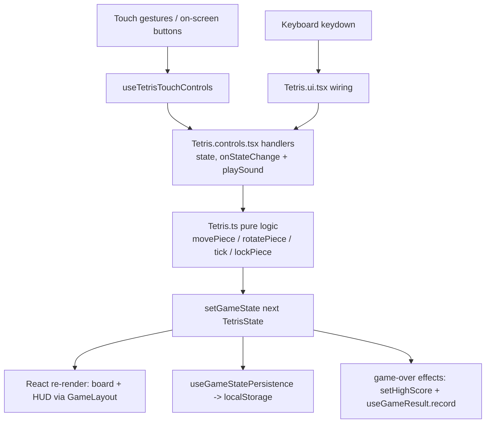

# Game Hub — Architecture README

A collection of **34 classic browser games** (arcade, puzzle, board, card, word) built as a fast, mobile-first, installable PWA. Every game is split into three layers — **pure logic**, **input handling**, and **UI rendering** — so rules can be tested without React and controls can be swapped (keyboard / touch / swipe) without touching game rules.

> A deeper developer dossier also exists in [`PROJECT_DOCS.md`](./PROJECT_DOCS.md); this README is the architecture-focused companion.

---

## 1. Project Overview

| Aspect | Detail |
|---|---|
| **Framework** | React 18 + TypeScript (strict) |
| **Bundler / dev** | Vite 6 (`npm run dev`, `build`, `preview`, `typecheck`, `test` via Vitest) |
| **Styling** | Tailwind CSS 4 (via `@tailwindcss/vite`), utility classes + `index.css` theme rules (reduced-motion, colorblind) |
| **State management** | **No global state library.** Each game owns its own `useState` reducer-style state object; cross-cutting state flows through `localStorage` + a `gamehub:datachange` window event (settings, stats, achievements); pause state flows through a small React Context (`PauseProvider`) |
| **Routing** | `react-router-dom` v7 (`BrowserRouter` + lazy routes) |
| **Animations / icons** | `framer-motion`, `lucide-react` |
| **Sound** | Zero-dependency WebAudio oscillator engine (`lib/sound.ts`) |
| **PWA** | `public/manifest.webmanifest`, `public/sw.js` (offline shell), registered in `main.tsx` |

**Entry point chain:**
`src/main.tsx` (React root + service worker registration) → `src/App.tsx` (routes + appearance settings applied from persisted settings) → `components/app/AppShell.tsx` (nav) / `features/game-session/GameSession.tsx` (fullscreen play view) → lazy-loaded game component from `data/games.ts`.

**Key routes:**

```
/                 Home              /history      History
/games            Library           /favorites    Favorites
/games/:slug      GamePreview       /leaderboard  Leaderboard
/play/:slug       GameSession       /settings     Settings
                                    /daily        Daily
                                    /achievements Achievements
```

`GameSession` is deliberately *outside* `AppShell` (full-bleed fullscreen), wraps the game in an `ErrorBoundary`, and mounts each game inside a **`PauseProvider`** keyed by slug.

---

## 2. Folder Structure

```
src/
├── main.tsx                     # React entry; registers service worker (prod only)
├── App.tsx                      # Router, lazy routes, applies theme/motion settings
├── index.css                    # Tailwind import + reduced-motion/colorblind CSS rules
├── components/
│   ├── app/AppShell.tsx         # Top nav shell for content pages (desktop + mobile menu)
│   ├── game/GameArtwork.tsx     # CSS-based game thumbnails for cards
│   └── ui/
│       ├── GameLayout.tsx       # Shared game HUD: title, score/best, pause & reset buttons, pause overlay, optional DifficultySelector
│       ├── DifficultySelector.tsx / Modal.tsx / Button.tsx / GameCard.tsx
│       ├── AchievementToast.tsx # Achievement unlock toast (listens for 'gamehub:achievements')
│       ├── CalendarHeatmap.tsx  # Daily progress visualization
│       ├── PassDeviceOverlay.tsx# Hotseat pass-the-device screen
│       └── controls/            # VirtualDPad, TouchActionButton, TouchControlContainer (shared mobile controls)
├── data/games.ts                # Registry: metadata + lazy component import per game
├── features/                    # One folder per route/page (see routes above)
├── games/                       # 34 games; one folder per game (see §3)
├── hooks/                       # Shared React hooks (result recording, save/resume, difficulty, sound, …)
├── lib/                         # Framework-agnostic modules: persistence, sound, difficulty, daily, achievements, gameResult, pause, random (seeded RNG), storage
└── types/game.ts                # GameDefinition, GameControls, GameInstructions, categories/difficulty types
public/                          # PWA manifest, icons, sw.js
```

**Top-level folder purposes (one line each):**

- `components/` — shared presentational UI, split by scope (`app/`, `game/`, `ui/`).
- `data/` — the game registry (`games.ts`): id, slug, metadata, controls docs, and `lazy(() => import('../games/<slug>'))` per game.
- `features/` — route-level pages; each reads/writes `lib/persistence.ts` and renders `components/`.
- `games/` — the games themselves, three-layer architecture per game.
- `hooks/` — reusable React hooks shared by features and games.
- `lib/` — non-React logic: persistence, sound engine, difficulty presets, achievements, daily challenges, pause context, seeded RNG.
- `types/` — shared TypeScript contracts (`GameDefinition` is the contract between `data/games.ts` and game folders).

---

## 3. Per-Game Breakdown

Every game folder follows the same **4-file convention**:

```
src/games/<slug>/
├── <Game>.ts             # Pure game logic — NO React, NO DOM, fully testable
├── <Game>.controls.tsx   # Input handling — keyboard/touch handlers + control hooks
├── <Game>.ui.tsx         # Default-exported React component (view + wiring)
└── index.ts              # Barrel: re-exports ui as default + logic & controls
```

Optional extras: `<Game>.test.ts` (pure-logic unit tests — exists for `connect-four`, `game-2048`, `minesweeper`, `tic-tac-toe`, plus `lib/random.test.ts`).

### Reference implementation: Tetris

#### `src/games/tetris/Tetris.ts` — pure logic
- **Role:** state machine and board math. No React, no DOM, no input.
- **Exports:**
  - `BOARD_WIDTH` (10), `BOARD_HEIGHT` (20), types `TetrominoType`, `Position`, `Piece`, `TetrisState` (board, currentPiece, nextPiece, score, lines, level, isRunning, isGameOver, isPaused)
  - `createEmptyBoard()`, `createPiece(type)`, `getRandomTetromino()`, `createInitialState()`
  - `isValidPosition(board, piece, dx?, dy?)` — collision test
  - `rotatePiece(piece)`, `movePiece(piece, dx, dy)` — pure transforms
  - `lockPiece(state)` — welds piece, clears lines, scores, levels up, spawns next piece, checks game over
  - `tick(state)` — one gravity step; falls through to `lockPiece` when blocked
- **Imports:** none.

#### `src/games/tetris/Tetris.controls.tsx` — input handling
- **Role:** translates an *action* into a new state via the `state, onStateChange` convention; also hosts the swipe-gesture hook. Plays sound effects.
- **Exports (all take `(state, onStateChange)`):**
  - `handleMoveLeft` / `handleMoveRight` / `handleMoveDown` — validated movement, `playSound('move')`
  - `handleRotate` — rotation with wall-kick offsets `[0,0] → [±1,0] → [±2,0] → [0,-1]`, `playSound('click')`
  - `handleHardDrop` — drops to floor then `lockPiece`, `playSound('success')`
  - `handlePause` — flips `state.isPaused`
  - `useTetrisTouchControls(state, onStateChange)` — returns `{ onTouchStart, onTouchMove, onTouchEnd, onTouchCancel }`; swipe left/right (debounced, continuous delta), swipe down (soft drop; fast/long swipe = hard drop), tap = rotate, long-press tracking; keeps latest state/callback in refs to avoid stale closures mid-gesture.
- **Imports:** `./Tetris` (logic), `../../lib/sound` (`playSound`).

#### `src/games/tetris/Tetris.ui.tsx` — UI + wiring
- **Role:** the React component. Owns `gameState`, runs the loop, wires keyboard + touch + on-screen buttons, persists state, records results.
- **Exports:** `default function Tetris()`.
- **Key responsibilities:**
  - `useState(() => loadSavedState<TetrisState>('tetris', …) ?? createInitialState())` — resume support
  - `useGameStatePersistence('tetris', gameState, s => s, s => !s.isGameOver)` — autosave
  - `usePause()` — reads the `PauseProvider` context; its `paused` also gates the interval loop (via `pausedRef`)
  - Game loop: `setInterval` calling `tick`, speed derived from level × `getDifficultySettings(difficulty).speedMultiplier`
  - High score: `useEffect` on game-over → `setHighScore('tetris', score)`
  - `useGameResult('tetris')` — `record({ won, score })`
  - Keyboard `keydown` handler → control functions with `setGameState` as `onStateChange`
  - Renders with shared `GameLayout` (HUD + pause overlay), grid board, start/game-over overlays, and a row of mobile buttons (←, Rotate, →, ↓, Drop, Pause).
- **Imports:** `components/ui/GameLayout`, `lib/persistence`, `hooks/useGameResult`, `lib/pause`, `hooks/useGameStatePersistence`, `hooks/useDifficulty`, `lib/difficulty`, and both siblings (`./Tetris`, `./Tetris.controls`).

#### `index.ts`
```ts
export { default } from './Tetris.ui';
export * from './Tetris';
export * from './Tetris.controls';
```

### All 34 games (same 4-file skeleton unless noted)

`aim-trainer, battleship, blackjack, breakout, checkers, connect-four*, dots-and-boxes, fifteen-puzzle, flappy-bird, game-2048*, gomoku, hangman, idle-clicker, lights-out, mancala, mastermind, memory-match, minesweeper*, pong, reaction-timer, reversi, rock-paper-scissors, simon-says, snake, sokoban, solitaire, sudoku, tetris, tic-tac-toe*, typing-game, whack-a-mole, word-search, wordle, yahtzee` — `*` = has a `<Game>.test.ts`.

**Notable per-game variations:**

| Game | Deviation from the standard pattern |
|---|---|
| `game-2048` | Controls file exports `useKeyboardControls` + `useSwipeControls(onMove, isEnabled)` (tap/swipe mapping), plus a test file. |
| `breakout`, `pong` | Canvas rendering; controls export `useMouseControls` + `useTouchControls(canvasRef, paddleRef)` that drive a paddle ref rather than dispatching discrete state changes. |
| `flappy-bird` | Canvas; `useKeyboardControls(handleJump)` + `useTouchControls(canvasRef, handleJump)` (tap to flap). |
| `aim-trainer` | Minimal controls file — just `handleTargetClick`/`handleMissClick` guards around `onHit`/`onMiss` callbacks; no sound, no gesture hook. |
| `idle-clicker` | Controls use `onClick`/`onBuy` callback names instead of `onStateChange`. |
| `reversi`, `checkers`, `battleship` | Local hotseat; `reversi` uses `PassDeviceOverlay` for the between-turn handoff. |
| `tic-tac-toe`, grid puzzles (`gomoku`, `sudoku`, `memory-match`, …) | UI uses `useGridKeyNav(cols)` for arrow-key focus navigation (a11y). |
| `snake`, `sokoban` | Use the shared `VirtualDPad` + `TouchControlContainer` components instead of (or alongside) gesture hooks. |
| `wordle`, `word-search`, `hangman`, `typing-game` | Text-input controls (`handleLetterInput`, `handleBackspace`, `handleSubmit`, `handleWordClick`); their UI wraps `setGameState` in an `onStateChange` closure that also triggers result recording. |

## 4. Shared Architecture Patterns

### 4.1 The `state, onStateChange` control convention
Every exported handler in a `*.controls.tsx` file has the signature:

```ts
function handleX(state: GameState, onStateChange: (next: GameState) => void, ...args): void
```

Rules of the pattern:
1. Guard clauses first (`isGameOver` / `isPaused` / invalid input → no-op, return).
2. Compute the next state using **pure logic functions** from `<Game>.ts` (handlers never mutate).
3. Call `onStateChange(next)` only when state actually changes (some games compare `next !== state` before notifying).
4. Handlers are side-effect-light: the only expected side effects are `playSound(...)` calls.

The UI passes its own state setter: `handleMoveLeft(gameState, setGameState)`. Games that must react to a win at the moment of the change (wordle, word-search) wrap the setter: `(next) => { setGameState(next); if (next.isWon) record(...) }`.

### 4.2 Shared UI/session stack

- **`GameLayout`** (`components/ui/GameLayout.tsx`) — every game's root wrapper. Props: `title, score, highScore, onReset, showDifficulty, pauseOnSpace`. It reads `usePause()` for the pause button/overlay and binds global shortcuts: **P** always toggles pause; **Space** toggles unless `pauseOnSpace={false}` (games that use Space as a gameplay key, like Tetris hard-drop).
- **`usePause`** (`lib/pause.tsx`) — `PauseProvider` context mounted once per game session by `GameSession` (`<PauseProvider key={slug}>`), giving `{ paused, toggle, setPaused }`. Games stop their own timers/loops when `paused` is true (via a `pausedRef` inside interval callbacks). Outside a provider, `usePause` returns a safe no-op.
- **`useGameResult(gameId, { daily })`** (`hooks/useGameResult.ts`) — returns `{ record }`; `record` delegates to `lib/gameResult.finishGame`, the **single entry point** for finishing a game: records stats (`recordGameResult`), plays the win/lose sound, completes the daily challenge when `options.daily`, and checks/unlocks achievements (dispatching the `gamehub:achievements` event consumed by `AchievementToast`).
- **`useDifficulty`** (`hooks/useDifficulty.ts`) — reads/writes difficulty in persisted settings and stays in sync across components via the `DATA_CHANGE_EVENT` broadcast. Games pass `showDifficulty` to `GameLayout` and translate difficulty via `getDifficultySettings(difficulty)` → multipliers (`timeMultiplier`, `speedMultiplier`, `sizeMultiplier`, `complexityMultiplier`, `scoreMultiplier`) from `lib/difficulty.ts`.

### 4.3 Persistence pattern
All storage is namespaced `localStorage` under `gamehub_*` (`lib/persistence.ts`, versioned envelopes `{ v: 1, data }`), with a `gamehub:datachange` window event after writes.

- **High scores:** `getHighScore(gameId)` / `setHighScore(gameId, score)` (only ever increases). Games load it into state on mount and update it in an effect on game-over.
- **Save/resume:** `hooks/useGameStatePersistence.ts` exposes
  - `loadSavedState(gameId, deserialize)` — read + safely deserialize a saved state (init function of `useState`).
  - `useGameStatePersistence(gameId, state, serialize, shouldSave)` — writes every 2 s, on `pagehide`, and on unmount; **clears** the saved state when `shouldSave(state)` is false (typically `s => !s.isGameOver`), so finished games don't resurrect.
  - `clearSavedState(gameId)` — explicit wipe on intentional reset.
- **Per-game metadata:** play count, last played, recently played, favorites.
- **Aggregate:** `GameStats` (plays/wins/streaks/per-game bests) via `recordGameResult`, daily progress, achievements, settings — all through the same persistence layer.

### 4.4 Sound system
`lib/sound.ts` — a dependency-free WebAudio engine:

- Effect vocabulary: `'click' | 'move' | 'success' | 'gameover' | 'highscore' | 'tick'`, implemented as oscillator `tone(...)` recipes; plus `playTone` for custom tones (e.g., Simon Says pitches).
- `playSound(effect)` respects the `soundEnabled` setting (checked live from `getSettings()`); `setSoundEnabled` toggles + suspends/resumes the context.
- The context resumes on the first `pointerdown`/`keydown` (autoplay policy).
- Games call it directly from controls files (Tetris) or through the tiny `useSound()` hook (`const play = useSound(); play('click')`) in UI files (wordle, sokoban, …). `finishGame` also plays success/gameover automatically.

## 5. Data Flow (Tetris example)

```
                     ┌──────────────────────────────────────────────────┐
   User input        │              Tetris.ui.tsx (component)           │
 ─────────────┐      │                                                  │
 Keyboard  ────┤     │  gameState (useState) ──► render board/HUD       │
 (keydown →   │      │       ▲                        ▲                 │
  handleKeyDown)     │       │                        │                 │
 Touch     ────┼──►  useTetrisTouchControls (Tetris.controls.tsx)     │
 (swipe/tap/  │      │       │  onStateChange = setGameState            │
  long-press) │      ├───────┴──────────────────────────────────────────┘
 On-screen ────┘              │
 buttons                      ▼
                     handleMoveLeft/Right/Down/Rotate/HardDrop
                            (Tetris.controls.tsx)
                              │  guards: isPaused / isGameOver
                              │  side effect: playSound('move'|'click'|…)
                              ▼
                     movePiece / rotatePiece / isValidPosition / lockPiece
                            (Tetris.ts — pure logic, no React)
                              │
                              ▼  next immutable TetrisState
                     setGameState(nextState) ──► React re-render (board/HUD)
                              │
              ┌───────────────┼─────────────────────┐
              ▼               ▼                     ▼
  useGameStatePersistence   game loop (setInterval   useGameResult /
  → localStorage (save/     → tick(state) → back to  setHighScore on
    clear on game over)       pure logic)            isGameOver
```

**Mermaid version:**



**Where other games deviate:**
- **Canvas games** (breakout, pong, flappy-bird): the render step is a `<canvas>` draw loop, and touch/mouse controls write into a *ref* (`paddleXRef`) instead of dispatching discrete state transitions; state is synced from refs each frame.
- **Continuous swipe games** (2048): `useSwipeControls` computes a direction and calls `handleMove(state, dir, onStateChange)` — the same control convention, just direction-based.
- **Hotseat games** (reversi, checkers, battleship): after a move, turn handoff can route through `PassDeviceOverlay` before allowing the next input.
- **D-pad games** (snake, sokoban): `VirtualDPad.onDirectionPress` calls the same `handle*` controls functions that keyboard uses.

## 6. Known Gaps / Inconsistencies

1. **Gesture support is uneven.** Only a subset of games implement gesture hooks (`Tetris`, `Game2048`, `Breakout`, `Pong`, `FlappyBird`) or the shared D-pad components (`Snake`, `Sokoban`). Many games ship only plain `<button>` rows or click targets — usable but not gesture-optimized.
2. **Inconsistent touch UIs.** Tetris renders *raw buttons* for mobile instead of the shared `VirtualDPad` / `TouchActionButton` / `TouchControlContainer` primitives used by Snake/Sokoban.
3. **Inconsistent sound usage.** Tetris plays sounds inside controls handlers; wordle/word-search/sokoban use `useSound()` in the UI layer; aim-trainer and idle-clicker play none. Convention not enforced.
4. **Inconsistent callback naming.** `onStateChange` is the dominant convention, but idle-clicker uses `onClick`/`onBuy`, aim-trainer uses `onHit`/`onMiss`, breakout/pong bypass it entirely with refs.
5. **Duplicate pause sources of truth.** Tetris carries both `isPaused` *and* reads the `PauseProvider` context (`pausedRef`); other games rely on the context only.
6. **Folder naming inconsistency.** `game-2048` breaks the kebab-case `<name>` convention, and its class prefix (`Game2048`) diverges from the slug.
7. **Test coverage is sparse.** Only 4 of 34 games have pure-logic tests (`connect-four`, `game-2048`, `minesweeper`, `tic-tac-toe`) — the pure-logic layer makes them trivial to add everywhere.
8. **Dev debugging ergonomics.** All lazy chunks resolve from a generic `index.ts` barrel; consider naming it after the game for clearer stack traces.
9. **`supportsSave` metadata drift risk.** Registry flags must be kept in sync manually with whether a game actually wires `useGameStatePersistence`.
10. **Root-level debris.** `render-check.mjs`, `tmp-verify.mjs` at repo root and `PROJECT_STRUCTURE_PROPOSAL.md` appear to be scratch files.

## 7. How to Add / Fix a Game (e.g., applying the mobile-gesture-control fix everywhere)

A change to game controls touches **at most three files per game**. Checklist per game `<slug>` / `<Game>`:

1. **`src/games/<slug>/<Game>.controls.tsx`** *(required)*
   - Ensure every action has a `handle*(state, onStateChange, …)` function following the guard → pure-logic → notify pattern.
   - Add/extend a gesture hook (`useSwipeControls`-style) mapping touch events to those handlers, keeping latest `state`/`onStateChange` in refs (copy the Tetris `useTetrisTouchControls` or 2048 `useSwipeControls` template; prefer extracting these into a shared hook in `src/hooks/` to stop further duplication).
2. **`src/games/<slug>/<Game>.ui.tsx`** *(required)*
   - Call the gesture hook and spread its handlers onto the board/play-area element (`onTouchStart` / `onTouchMove` / `onTouchEnd` / `onTouchCancel`), with `e.cancelable && e.preventDefault()` inside the handlers.
   - Replace raw mobile `<button>` rows with `TouchControlContainer` + `VirtualDPad` / `TouchActionButton` from `src/components/ui/controls/` (see `Sokoban.ui.tsx` for the canonical layout).
   - Keep `GameLayout` as the root; pass `pauseOnSpace={false}` if Space is a gameplay key.
3. **`src/games/<slug>/<Game>.ts`** *(only if actions are missing)* — add the pure logic function first, kept free of React/DOM so it can be unit-tested.
4. **Optionally `<Game>.test.ts`** — cover the new/changed logic functions (Vitest, `npm test`).
5. **`src/data/games.ts`** *(if surface area changed)* — update the game's `controls.touch` documentation strings so the preview page matches the actual gestures.

**Sanity checks:** `npm run typecheck && npm run lint && npm test && npm run build`; then manually verify on a touch device that scrolling isn't hijacked outside the play area and that pause (P/Space/button) still works.

**Adding a brand-new game:** create the 4-file folder (`<Game>.ts`, `<Game>.controls.tsx`, `<Game>.ui.tsx`, `index.ts`), wire `lazy(() => import('../games/<slug>'))` + metadata into `data/games.ts`, wrap state with `loadSavedState` + `useGameStatePersistence`, mount in `GameLayout`, and record results with `useGameResult`.

## Getting started

```bash
npm install
npm run dev       # start the dev server
npm run build     # production build
npm run preview   # preview the production build
npm run typecheck # type-check only
npm test          # vitest (pure-logic unit tests)
```


